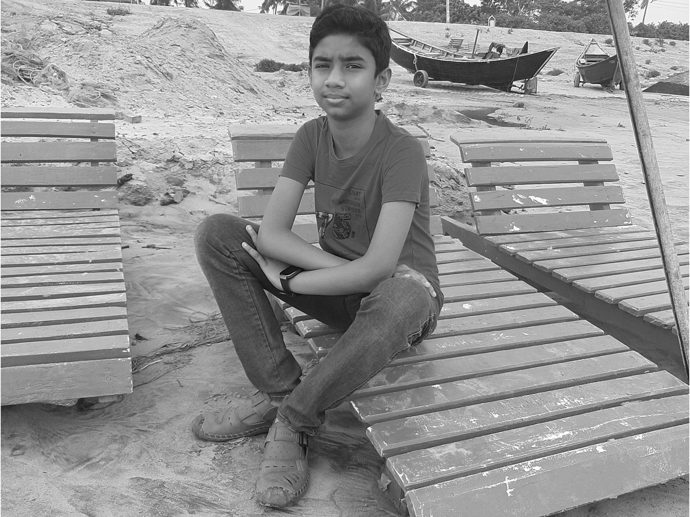

<!-- @format -->

## 🙋‍♀️ Hello, This is Ankit Sana

A passionate programmer and learner. Currently learning full stack web development using MongoDB, Express, Node and React.

### 👨🏽‍💻 About Me

I'm a 13 year old programmer who is currently learning to build web application. I live in Khulna, Bangladesh. I can design web apps using HTML, CSS and JavaScript. And now I am trying my best to be as good as I can in web development.

### 🤹‍♀️ My Skills

| Languages  | Skill |
| ---------- | ----- |
| HTML       | 92%   |
| CSS        | 86%   |
| JavaScript | 88%   |
| React      | 82%   |
| Node       | 74%   |
| Express    | 70%   |

## 👨‍🎓 Education

1. Currently Studying in Khulna Zilla School

## 👨‍🏭 Projects

- [Simple Recipes Using HTML CSS and some JavaScript](https://github.com/AritrSana/Simply-Recipes-html-css-js)

- [Todo App Using HTML CSS and JavaScript](https://github.com/AritrSana/Complete-Todo-App)
- [Weather App](https://github.com/AritrSana/react-weather-app)

## 📞 Contract

**Email: ankitsana935@gmail.com**
